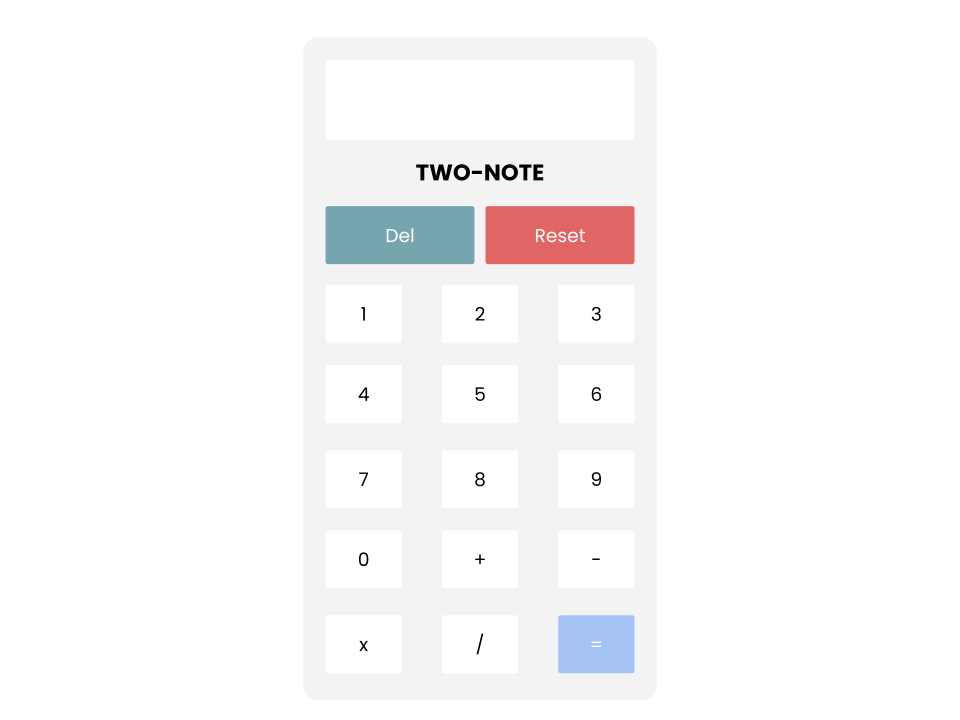

# Two-Note Calculator (v 1.0)

<a href='https://calculator-orcin-eight.vercel.app/'>Click Here to Check it Out</a>

</img>

## About Project

Two-Note is a very simple calculator that performs some very basic mathematics. Addition, subtraction, division and multiplication.

## Technologies Used

    </img>

## Limitations of v 1.0
 - Doesn't work with expressions that have a leading math symbol e.g. -2+2
 - Only limited to add, subtract, multiply and divide.
 - Does not perform complicated computations.
